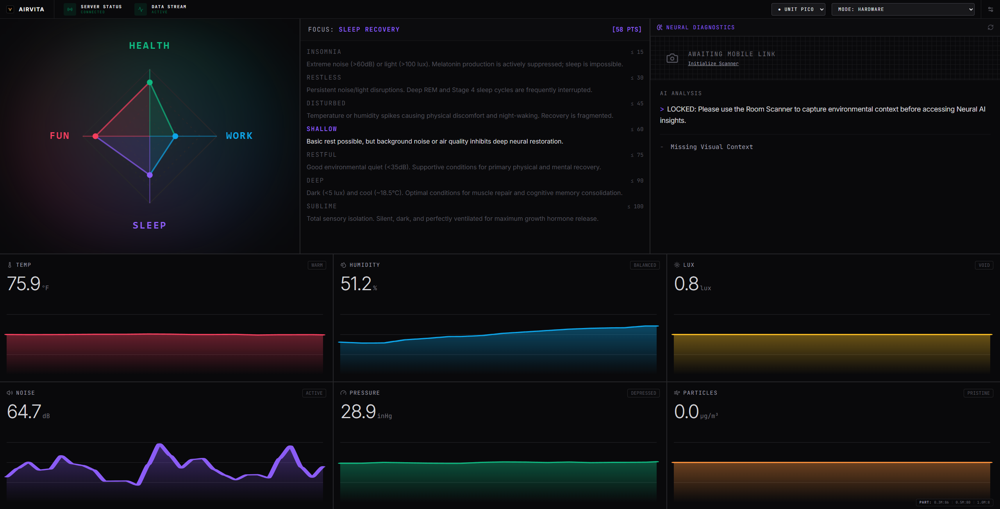
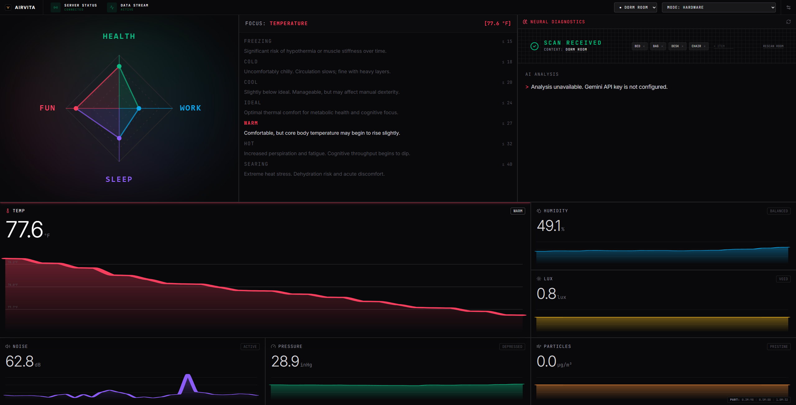
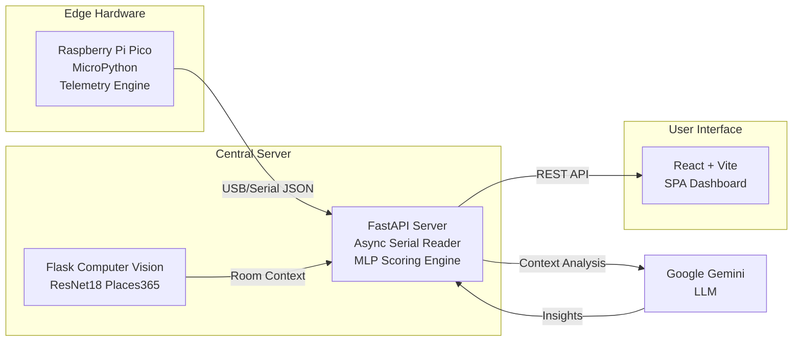

<div align="center">
  
  
  # AirVita: Edge AI Room Environment Monitor

  **A full-stack, machine-learning-driven IoT system for holistic indoor air quality monitoring.**

  [](https://opensource.org/licenses/MIT)
  [](https://fastapi.tiangolo.com/)
  [](https://reactjs.org/)
  [](https://www.docker.com/)
  [](https://micropython.org/)
</div>

---

## Overview

AirVita is a comprehensive Internet of Things (IoT) environment monitoring system designed to provide real-time, actionable insights into your indoor air quality and overall room health. 

Unlike basic sensors that only display raw data, AirVita leverages a custom-trained **Multi-Layer Perceptron (MLP)** neural network alongside **Generative AI** and **Computer Vision** to understand the *context* of your environment and provide personalized health recommendations.

---

## Screenshots

<div align="center">
  
  <br />
  
</div>

---

## Features

- **Real-Time Telemetry**: Sub-second latency streaming from edge devices (Pico / Pi 4B) to the React dashboard.
- **ML-Driven Health Scoring**: An algorithmic 1-99 IAQ score derived from a trained neural network, accounting for temperature, humidity, light, acoustics, and barometric pressure.
- **Hazard Penalties**: Strict linear safety penalties applied instantly for PM2.5 particulates and VOC gas detections.
- **Contextual AI**: Integrates with a ResNet18 Computer Vision model to classify the room type, feeding the Google Gemini LLM for personalized air quality recommendations.

---

## System Architecture

The architecture follows a decoupled, highly concurrent three-tier model ensuring low latency and robust fault tolerance.

<div align="center">
  


</div>

---

## Hardware Bill of Materials (BOM)

To build the primary edge device, you will need:
- **Microcontroller**: Raspberry Pi Pico
- **Environment Sensor**: BME688 (Temperature, Humidity, Pressure, VOCs)
- **Particulate Sensor**: Plantower PMS5003 (PM1.0, PM2.5, PM10)
- **Light Sensor**: GY-302 / BH1750 (Lux)
- **Microphone**: INMP441 (I2S Digital Audio)
- **Display**: LCD 1602 (I2C)

*Hardware validation scripts for these components can be found in `pico/test/v2/`.*

---

## Quick Start Guide

### Prerequisites
- Python 3.11+
- Node.js 18+
- Docker & Docker Compose (Optional, for simulation only)

### 1. Prepare the Hardware (Raspberry Pi Pico)
Your Pico must be running the JSON telemetry firmware, not the text-based dashboard. If you need to flash the correct firmware to the Pico, you can do so automatically via the command line (adjust COM6 to your port):
```bash
pip install mpremote
python -m mpremote connect COM6 fs cp pico\main.py :main.py
python -m mpremote connect COM6 reset
```

### 2. Run Locally (One-Click Native Script)
Because Docker Desktop on Windows/macOS does not natively support USB passthrough, the easiest way to run the full stack with live hardware is natively on your machine.

Simply run the 1-click start script:
```powershell
.\start_native.ps1
```
This script will ask for your COM port (default COM6), and then automatically launch both the Backend and Frontend in separate windows. 
The secure dashboard will be accessible at `https://localhost:5173`.

### 3. Manual Containerized Deployment (Docker Simulation)
If you do not have hardware connected and just want to run the simulation using Docker Compose:

```bash
# macOS/Linux
./start.sh

# Windows
.\start.ps1
```

> [!WARNING]
> **Windows/macOS USB Passthrough Constraints**
> Docker Desktop on these operating systems does not natively support USB serial passthrough. You must either run the application natively using `.\start_native.ps1`, or utilize `MOCK_SERIAL=true` (which the Docker start scripts default to). See the [Deployment Guide](DEPLOYMENT.md) for details.

---

## Intelligence & Scoring

The system computes a composite Room Health Score ranging from 1 (Hazardous) to 99 (Optimal).

| Sensor Metric  | ML Weighting | Optimal Range |
| :--- | :--- | :--- |
| Temperature | 20% | 20 to 24 °C |
| Humidity | 15% | 40 to 60 %RH |
| Ambient Light | 10% | 300 to 500 lux |
| Acoustic Noise | 15% | 0 to 40 dB |
| Barometric Pressure | 10% | 1000 to 1025 hPa |
| Particulate Matter (PM2.5)| Penalty | 0 to 35 µg/m³ |
| Volatile Organic Compounds| Penalty | 0 to 300 ppb |

---

## Related Documentation

For detailed information on specific modules, refer to the following documentation:

- **[Deployment Guide](file:///c:/Projects/HackAugie/DEPLOYMENT.md)**: Container orchestration and startup scripts.
- **[API Reference](file:///c:/Projects/HackAugie/API.md)**: Data schema for the `/api/sensor-data` endpoint.
- **[Backend Service](file:///c:/Projects/HackAugie/backend/README.md)**: FastAPI REST architecture and environment variables.
- **[Frontend Dashboard](file:///c:/Projects/HackAugie/frontend/README.md)**: React SPA architecture and UI layout.
- **[Machine Learning](file:///c:/Projects/HackAugie/backend/model/README.md)**: The scoring methodology and MLP training.
- **[Computer Vision Scanner](file:///c:/Projects/HackAugie/scanner/README.md)**: The ResNet18 room context classifier.
- **[Pico Firmware](file:///c:/Projects/HackAugie/pico/README.md)**: Production edge code for the Raspberry Pi Pico.
- **[Hardware Tests](file:///c:/Projects/HackAugie/pico/test/v2/README.md)**: V2 hardware validation suite.
- **[Pi 4B Firmware](file:///c:/Projects/HackAugie/pi4B/README.md)**: Autonomous edge code for the Pi 4B node.
- **[Pico Serial Bridge](file:///c:/Projects/HackAugie/PICO_BRIDGE.md)**: Middleware for routing Pico serial data over HTTP.

---

## License

This project is licensed under the MIT License - see the [LICENSE](LICENSE) file for details.
