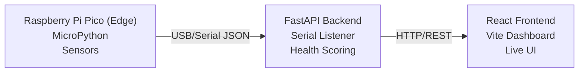

# AirVita: IoT Room Environment Monitor

AirVita is a comprehensive, full-stack Internet of Things (IoT) room environment monitoring system. It leverages a Raspberry Pi Pico for edge sensor data collection, processes the telemetry through a highly concurrent FastAPI backend, and visualizes real-time environmental metrics via a responsive React frontend dashboard.

## System Architecture

The architecture follows a decoupled, three-tier model ensuring low latency and high reliability:



## Directory Structure

```text
HackAugie/
├── pico/               # MicroPython edge firmware
│   └── main.py         # Sensor reading and serial output integration
├── backend/            # FastAPI server and serial listener
│   ├── app/
│   │   ├── main.py     # Application entry point
│   │   ├── serial_reader.py # PySerial USB listener
│   │   ├── scoring.py  # Health Score algorithmic engine
│   │   └── models.py   # Pydantic data validation models
│   ├── requirements.txt
│   └── Dockerfile
├── frontend/           # React and Vite dashboard UI
│   ├── src/
│   │   ├── components/ # Reusable UI components
│   │   └── main.jsx    # React entry point
│   ├── index.html
│   ├── package.json
│   ├── vite.config.js
│   └── Dockerfile
├── docker-compose.yml
└── README.md
```

## Quick Start Guide

### Prerequisites
- Python 3.11 or newer
- Node.js 18 or newer
- Docker and Docker Compose (Optional, for containerized deployments)

### 1. Initializing the Backend

Navigate to the backend directory and install the required Python dependencies:

```bash
cd backend
pip install -r requirements.txt
```

Start the backend server. You can run it with mock data if a Pico is not connected:

```bash
# Execute with mock data generator:
MOCK_SERIAL=true uvicorn app.main:app --reload --host 0.0.0.0 --port 8000

# Execute with physical Pico connected (replace COM3 with your serial port):
SERIAL_PORT=COM3 uvicorn app.main:app --reload --host 0.0.0.0 --port 8000
```

### 2. Initializing the Frontend

Navigate to the frontend directory, install dependencies, and start the development server:

```bash
cd frontend
npm install
npm run dev
```

The frontend application will be accessible at `http://localhost:5173`.

### 3. Containerized Deployment (Docker)

To deploy the entire stack using Docker Compose:

```bash
docker-compose up --build
```

> [!WARNING]
> **Windows USB Passthrough Constraints**
> Docker Desktop on Windows does not natively support USB passthrough. When using Windows, either utilize `MOCK_SERIAL=true` within `docker-compose.yml` or run the backend natively specifying the `SERIAL_PORT`.

> [!NOTE]
> **Linux USB Passthrough**
> For Linux hosts, uncomment the `devices` section in `docker-compose.yml` to correctly map the serial device (e.g., `/dev/ttyACM0`).

### 4. Edge Device Provisioning

Deploy the firmware to your Raspberry Pi Pico by copying `pico/main.py` onto the device. Ensure it is running MicroPython. Upon booting, the Pico will autonomously begin streaming JSON-formatted sensor telemetry over USB serial.

## Environmental Health Scoring Algorithm

The system computes a composite Room Health Score ranging from 1 (Hazardous) to 99 (Optimal). This metric is calculated as a weighted average of individual sensor sub-scores based on established ideal environmental ranges.

| Sensor Metric  | Weighting | Optimal Range |
| :--- | :--- | :--- |
| Temperature | 20% | 20 to 24 °C |
| Humidity | 15% | 40 to 60 %RH |
| Ambient Light | 10% | 300 to 500 lux |
| Acoustic Noise | 15% | 0 to 40 dB |
| Barometric Pressure | 10% | 1000 to 1025 hPa |
| Particulate Matter (PM2.5)| 15% | 0 to 35 µg/m³ |
| Volatile Organic Compounds| 15% | 0 to 300 ppb |

## Related Documentation

For detailed information on specific modules, refer to the following documentation:

- **[Deployment Guide](file:///c:/Projects/HackAugie/DEPLOYMENT.md)**: Container orchestration and startup scripts.
- **[API Reference](file:///c:/Projects/HackAugie/API.md)**: Data schema for the `/api/sensor-data` endpoint.
- **[Backend Service](file:///c:/Projects/HackAugie/backend/README.md)**: FastAPI REST architecture and environment variables.
- **[Frontend Dashboard](file:///c:/Projects/HackAugie/frontend/README.md)**: React SPA architecture and UI layout.
- **[Machine Learning](file:///c:/Projects/HackAugie/backend/model/README.md)**: The scoring methodology and MLP training.
- **[Computer Vision Scanner](file:///c:/Projects/HackAugie/scanner/README.md)**: The ResNet18 room context classifier.
- **[Pico Firmware](file:///c:/Projects/HackAugie/pico/README.md)**: Production edge code for the Raspberry Pi Pico.
- **[Pi 4B Firmware](file:///c:/Projects/HackAugie/pi4B/README.md)**: Autonomous edge code for the Pi 4B node.
- **[Pico Serial Bridge](file:///c:/Projects/HackAugie/PICO_BRIDGE.md)**: Middleware for routing Pico serial data over HTTP.

## License

This project is licensed under the MIT License.